# Catalunya Landcover Dataset

|	| | |	|
|	:---:	|	:---:	|	:---:	|	:---:	|
|	Orthophoto RGB	|	Orthophoto Infrared	|	Sentinel-1	|	Sentinel-2 April	|
|	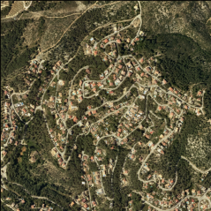|	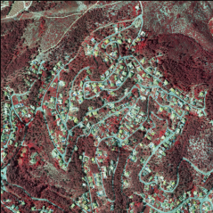 |	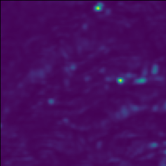	|	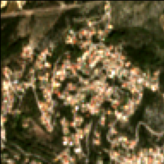	|
|	Sentinel-2 August	|	Aspect	| Digital Elevation Model | Slope |
|	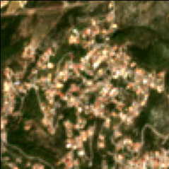	|	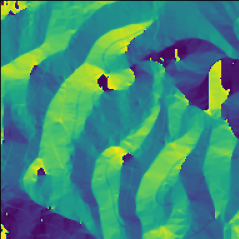 |	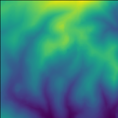|	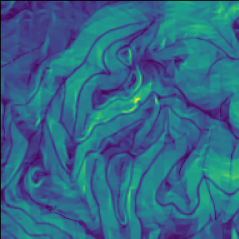 |
| Digital Surface Model | Canopy Height Model | Landcover |
|	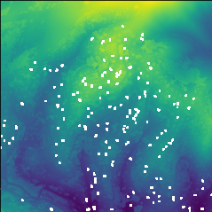	|	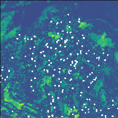	|	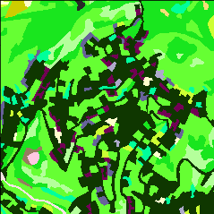	|

|	Class	|	Name	|	Color	|	Class	|	Name	|	Color	|
|	:---:	|	---	|	:---:	|	:---:	|	---	|	:---:	|
|	1	|	Herbaceous crops	|		|	22	|	"Eixample"	|		|
|	2	|	Orchard, plant nurseries and forced cultivation	|		|	23	|	Lax Urban Areas	|		|
|	3	|	Vineyards	|		|	24	|	Isolated buildings in rural areas	|		|
|	4	|	Olive groves	|		|	25	|	Isolated residential areas	|		|
|	5	|	Other woody crops	|		|	26	|	Green areas	|		|
|	6	|	Crops in transformation	|		|	27	|	Industrial or commercial	|		|
|	7	|	Dense coniferous forests	|		|	28	|	Sports and leisure areas	|		|
|	8	|	Dense deciduous forests	|		|	29	|	Mining or landfills	|		|
|	9	|	Dense forests of sclerophylls	|		|	30	|	Areas in transformation	|		|
|	10	|	Scrub	|		|	31	|	Road network	|		|
|	11	|	Clear coniferous forests	|		|	32	|	Urban bare ground	|		|
|	12	|	Clear deciduous forests	|		|	33	|	Airport areas	|		|
|	13	|	Clear forests of sclerophylls	|		|	34	|	Railway network	|		|
|	14	|	Meadows and grasslands	|		|	35	|	Port areas	|		|
|	15	|	Shore forest	|		|	36	|	Reservoirs	|		|
|	16	|	Bare forest soil	|		|	37	|	Lakes and lagoons	|		|
|	17	|	Burned areas	|		|	38	|	Watercourses	|		|
|	18	|	Rocky	|		|	39	|	Rafts	|		|
|	19	|	Beaches	|		|	40	|	Artificial channels	|		|
|	20	|	Wetlands	|		|	41	|	Sea	|		|
|	21	|	Urban area	|		|	0	|	Out of border	|		|

## Download data
Data can be directly downloaded from https://ftp.icgc.cat/descarregues/CatLCNet.

Although, due to the big size of the files, we recommend to download it using an FTP client.

| Server | Username | Password |
|	:---:	|	:---:	|	:---:	|
| ftp.icgc.cat | descarregues01 | descarregues01 |

## Data information
### Topographic Maps
| File | Size | Resolution | Version |
|	---	|	:---: |	:---:	|	:---:	|
| Aspect | 13.4 GB | 5m | v1 |
| Canopy height model | 336.4 GB | 1m | v1 |
| Digital Elevation Model | 13.4 GB | 5m | v1 |
| Digital Surface Model | 336.4 GB | 1m | v1 |
| Slope | 13.4 GB | 5m | v1 |

### Orthophoto
| File | Size | Resolution | Version |
|	---	|	:---: |	:---:	|	:---:	|
| RGB | 252.3 GB | 1m | v1 |
| Infrared | 84.1 GB | 1m | v1 |

### Sentinel-1
| File | Size | Resolution | Version |
|	---	|	:---: |	:---:	|	:---:	|
| January | 3.4 GB | 10m | v1 |
| February | 3.4 GB | 10m | v1 |
| March | 3.4 GB | 10m | v1 |
| April | 3.4 GB | 10m | v1 |
| May | 3.4 GB | 10m | v1 |
| June | 3.4 GB | 10m | v1 |
| July | 3.4 GB | 10m | v1 |
| August | 3.4 GB | 10m | v1 |
| September | 3.4 GB | 10m | v1 |
| October | 3.4 GB | 10m | v1 |
| November | 3.4 GB | 10m | v1 |
| December | 3.4 GB | 10m | v1 |
| Annual | 3.4 GB | 10m | v1 |

### Sentinel-2
| File | Size | Resolution | Version |
|	---	|	:---: |	:---:	|	:---:	|
| April | 16.8 GB | 10m | v1 |
| August | 16.8 GB | 10m | v1 |

### Landcover (groundtruth)
| File | Size | Resolution | Version |
|	---	|	:---: |	:---:	|	:---:	|
| Landcover | 84.1 GB | 1m | v1 |

# Other utilities
We recommend to use [gdal](https://gdal.org/) to view information of the different images
`gdalinfo image_example.tif`

# License

The use of data is subject to a Creative Common International Recognition 4.0 license. [More information](https://www.icgc.cat/en/The-ICGC/Public-Information/Transparency/Re-use-of-the-information)

It contains [Sentinel Copernicus](https://sentinel.esa.int/web/sentinel/home) data modified by the ICGC.

It is also requested that the methodologies and results obtained by the different scientific groups are shared with the ICGC through the following e-mail: [Dr. Oscar Mora](mailto:oscar.mora@icgc.cat)

# Developed by

[Institut Cartogràfic i Geològic de Catalunya (ICGC)](https://icgc.cat)

[Catalonia Multi-resolution Landcover Dataset (CatLC)](https://www.icgc.cat/en/Downloads/Aerial-and-satellite-images/Contingut/Catalonia-Multi-resolution-Landcover-Dataset-CatLC)